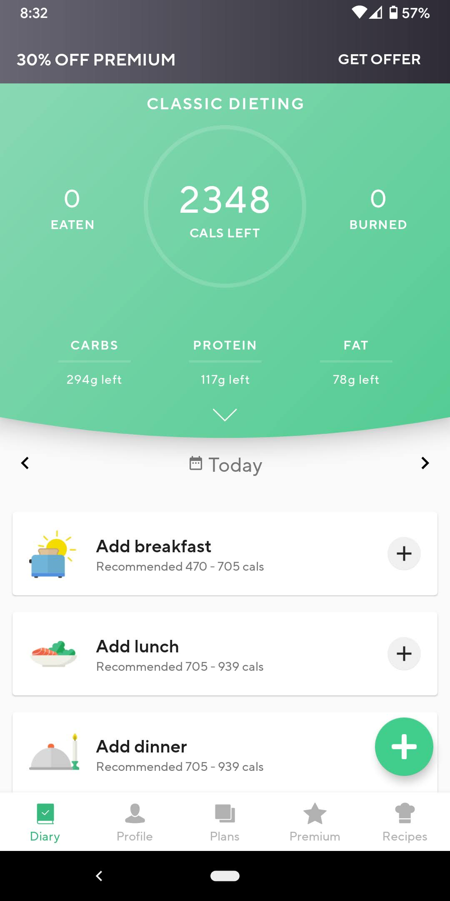
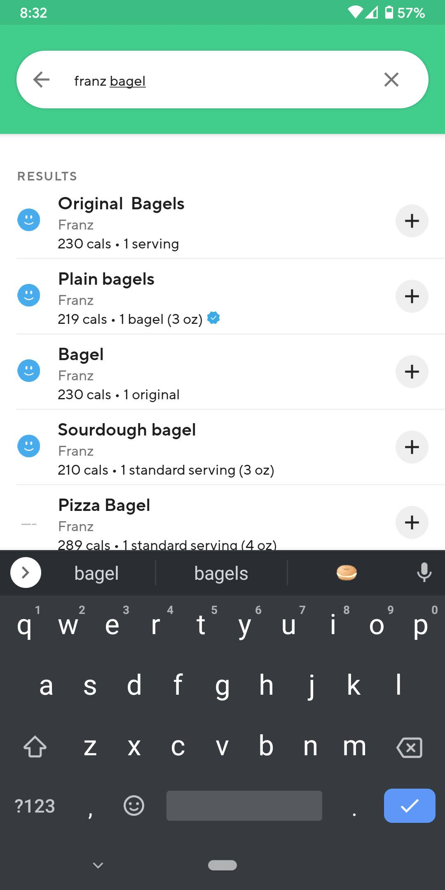
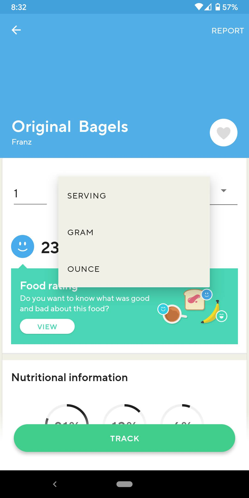
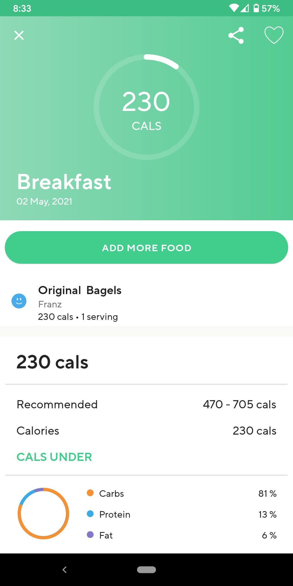
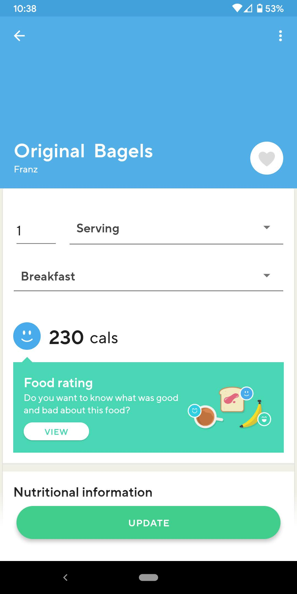
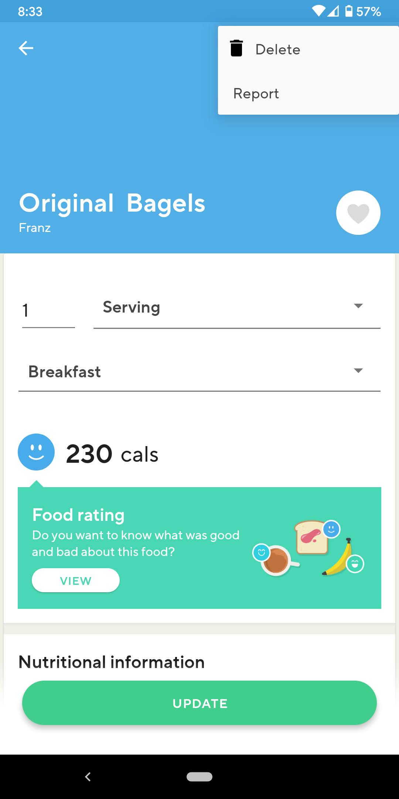

# Lifesum UI/UX
by Joseph Macam, 5/2/2021

Lifesum is a food tracking mobile used to keep track of what foods you eat and your daily caloric intake. 
My goals when using this app are typically to be able to find the foods I wish to add to my food log quick
and efficiently and to be able to make changes to my log in case of entry mistakes. 

The Usability/UX goals I want to highlight with this app are the **efficiency** and **error tolernace** aspects. 
Using a food intake tracking app, the steps to adding an item should be quick and simple, and one shouldn't have to struggle
with the menus to add a single food item. Thanfully, Lifesum does a pretty good job at making food entries simple and efficient.
The main landing page shows 4 meal sections for that current day. To make a food entry, you first choose the desired meal
you want to add an entry to and tap the "+" icon. This will then take you to a food search page.

##### A screenshot of the app when first opening it, showing the current day's log:

From the food search page, you simply enter the food you'd like to enter. You can also add the brand name for a more refined search. Once
you have found the food you wish to add, you once again tap the "+" icon next to that food, which will then take you to that food's page.

#### A screenshot of the food search page

Here you are given options about how much of the food you would like to add based on different measurements. They can be the labeled 
"serving size" that appears on the nutrition label, or you can choose a more specific measurement such as grams or cups. You can
also tap the grayed out heart icon next to the food name to add it to your favoites for quicker searches. With your measurements selected,
you simply tap the "Track" button on the bottom and the food will be added to the meal you had chosen prior.

#### A screenshot of an food items page

#### A screenshot of the breakfast page, one of the 4 "meal" sub-logs

With the goal of adding food into my food journal with minimal hassle, the Lifesum app is **efficient** and helps me accomplish
my food tracking goals. However, I believe the **error tolerance** of the app could be improved on. Specifically, making the steps
to delete a food entry should me more obvious and not require as much UI searching.

If you accidentally added a food item to you log and wished to remove it, my first instinct is to go to the food entry's page and delete it. 
However, at first glance, there appears to be no icon or button to delete an entry. However, on the top right of the screen, away from the 
rest of the food entry's buttons and functionality, there is a "3 dot" menu icon, and upon tapping it, it is revealed that the button to
delete the entry is here.

#### Screenshots of the 3-dot menu with the option to delete the item from the log

I believe that hiding the option to delete a food entry under a settings button away from the majority of the functionality for the food entry
page makes the process of removing a food entry from the journal more difficult and takes away from the apps **error tolerance**

